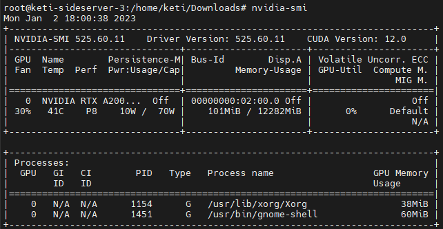
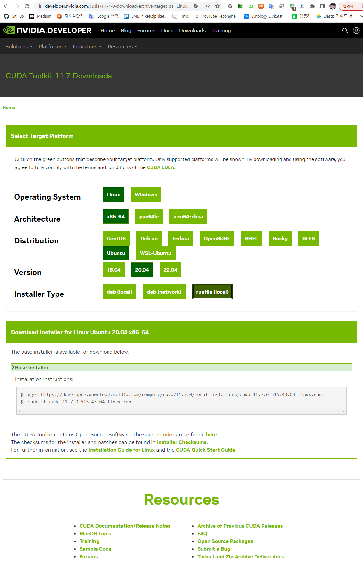
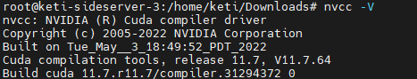
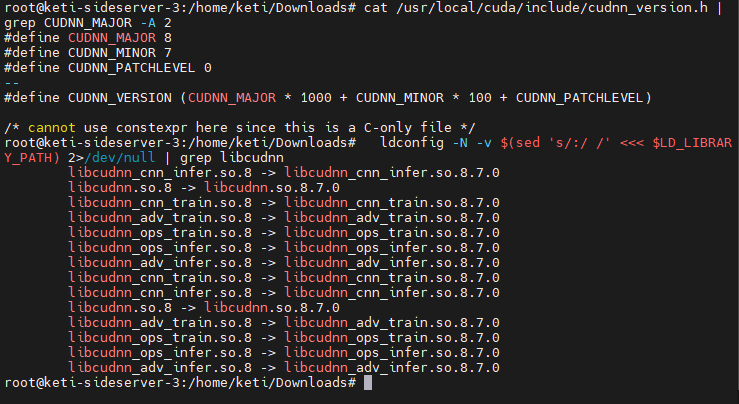
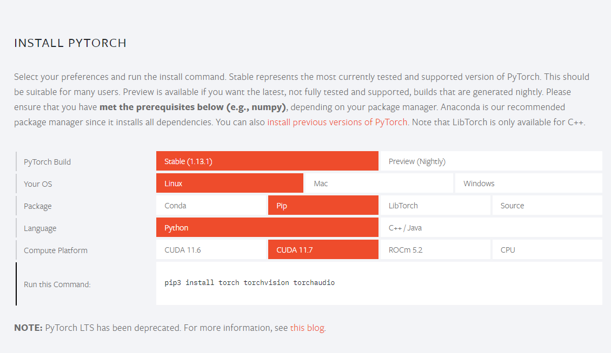

## Infomation
|||
|---|---|
|linux|ubuntu 20.04 LTS|
|그래픽 카드|RTX A2000 12GB|
|NVIDIA 드라이버|nvidia-driver-525|
|cuda|cuda-11.7.0|
|cudnn|cuDNN v8.7.0|
|pytorch|1.13.1|

## Nouveau 비활성화

그래픽카드 드라이버나 CUda를 설치하려고 여러번 시도하였지만, 이류를 모르겠는 재부팅, 무한 로딩, 커널 패닉 등 다양한 이슈가 발생했다. 아직도 이유를 모르겠지만 (참고 사이트) 해당 사이트에서 비슷한 이슈에 대해서 해결한 것 같아서 따라 해보았고, 여러분도 따라하길 바란다.

```bash
sudo vim /etc/modprobe.d/blacklist.conf

#아래 내용 추가
blacklist nouveau
options nouveau modeset=0
```
위 의 내용을 추가 한 후 다시 터미널에 아래 내용을 입력해준다.

```bash
sudo update-initramfs -u
```
위 내용을 입력해준후, 재부팅을 한다. 재부팅후 아래 내용을 입력했을 때 아무것도 나오지 않으면 비활성화가 된것이다.
```bash
lsmod |grep nouveau
```

## NVIDA 드라이버 설치
NVIDA 드라이버를 설치하는 방법은 2가지가 있다. 공식 홈페이지가서 간단하게 나에게 맞는 그래픽카드 정보를 기입후 추천해주는 드라이버를 설치하는 방법과 명령어를 통해 설치하는 방법이 있다. 여기서는 명령어를 사용하여 다운로드 하는 방법을 말하겠다.

아래 명령어를 치게되면, 지금 장착된 그래픽카드에 알맞는 드라이버 종류들이 나오게 된다.
```bash
ubuntu-drivers devices
```
여기서 나오는 목록중에 원하는 드라이버를 설치하면 되는데 주의할 점은 recommended 버전을 믿지말자... 왜냐하면 나에경우에 RTX A2000 기준으로 nvidia-driver-470이 추천이었지만 실제로 설치를 진행하였을 때는 에러가 발생하였다. 따라서, 나는 공식 홈페이지에서 추천해주는 **nvidia-driver-525** 버전으로 설치하였다. 설치 방법은 아래와 같다.
```bash
sudo apt-get install nvidia-driver-525
```

설치가 완료되면, 제대로 설치가 되었는지 아래 명령어를 통해 확인해보면 다음과 같은 결과가 나타난다.
```bash
nvidia-smi
```



## CUDA 설치
[cuda 설치](https://developer.nvidia.com/cuda-toolkit-archive)는 해당 링크에서 원하는 조건을 선택하면, 다운로드 받을 수 있다. 본 포스터에서는 **cuda-11.7.0**을 받았다. 본 포스터에서는 linux 버전의 cuda를 설치하였으므로, 아래 그림에서 제공하는 방법으로 다운로드 및 설치를 진행하면 된다. 



다운로드 받은 .run 파일을 실행하고 조금 기다려주면 아래와 같이 따라해주면된다. (이미 진행완료 되었기 때문에 부가적인 사진이 없다. 자세한 내용이 궁금하면, [여기](https://lee-jaewon.github.io/ubuntu/CUDA/)를 참고하면 된다.)

> - (.run 파일 실행 후) continue 선택
> - accept를 입력
> - 이전에 NVIDIA 드라이버를 깔았으니 드라이버 설치를 해제후 install 선택
> - 완료되면, 리눅스 창에 summery가 뜰것이다. 

마지막으로 아래 내용을 추가해준다.
```bash
sudo vi ~/.bashrc
```
```bash
#입력 후 저장
export CUDA_HOME=/usr/local/cuda-11.7
export PATH=/usr/local/cuda-11.7/bin:$PATH
export LD_LIBRARY_PATH=/usr/local/cuda-11.7/lib64:$LD_LIBRARY_PATH
```
```bash
source ~/.bashrc
```
위 명령어들을 통해 환경 변수 지정 후 **nvcc -V**명령어를 입력하면 아래와 같은 화면이 나오게된다.



여기서, 조금 햇갈렸던 부분이 있는데 nvidia-smi 명령어를 쳤을 때, 결과창에 CUDA version: 12.0과 nvcc -V 명령어를 쳤을 때 나온 CUDA version이 달라서 나혼자 뻘짓을 좀 했었다... nvidia-smi 결과창에 나온 CUDA version은 12 version 까지 지원한다는 것이고, nvcc -V 명령어를 입력 후 나온 CUDA version은 실제로 설치가 된 버전을 말한 것이다. 


## cuDNN 설치
cuDNN은 그래픽카드 가속을 도와주는 library이다. cuda 설치할때, 같이 되면 좋으련만... 따로 다운받아서 경로 설정을 해주어야한다.(귀찮게 NVIDIA 로그인도 해야한다....) 

[여기](https://developer.nvidia.com/cudnn)를 누른 후, 회원가입/로그인 후 설치된 CUDA와 호환되는 버전을 다운로드 하면된다. 본 포스터에서는 **cuDNN v8.7.0 for CUDA 11.x**를 다운 받았다.

```bash
#다운로드
wget "cudnn-linux-x86_64-8.7.0.84_cuda11-archive.tar.xz"
#압축해제
tar -xvf cudnn-linux-x86_64-8.7.0.84_cuda11-archive.tar
```
```bash
#설치
cd cudnn-linux-x86_64-8.7.0.84_cuda11-archive

sudo cp include/* /usr/local/cuda-11.7/include/
sudo cp lib/* /usr/local/cuda-11.7/lib64/
sudo chmod a+r /usr/local/cuda-11.7/include/cudnn.h /usr/local/cuda-11.7/lib64/libcudnn*
```
```bash
#설치 확인
 cat /usr/local/cuda/include/cudnn_version.h | grep CUDNN_MAJOR -A 2
  ldconfig -N -v $(sed 's/:/ /' <<< $LD_LIBRARY_PATH) 2>/dev/null | grep libcudnn
```




## PyTorch 설치 및 cuda 작동 확인
PyTorch 다운로드는 [여기](https://pytorch.org/)를 누른 후, 쉽게 설치할 수 있다. 본 포스터에서는 아래 와 같이 설정후 나온 명령어를 통해 쉽게 설치하였다. 



cuda가 잘 설치 되었는지 확인하기 위해서는 파이썬에 들어가 아래 명령어를 실행 시킨후 결과를 확인하면 된다. 
```python
import torch

# GPU 사용 가능 -> True, GPU 사용 불가 -> False
print(torch.cuda.is_available())
```


## 참고
- [https://lee-jaewon.github.io/ubuntu/CUDA/](https://lee-jaewon.github.io/ubuntu/CUDA/)
- [https://sanglee325.github.io/environment/install-CUDA-11-2/#](https://sanglee325.github.io/environment/install-CUDA-11-2/#)
